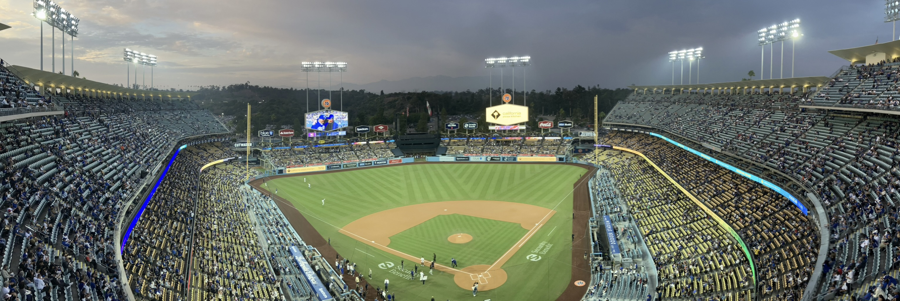

# Overview

`triple-green` is a personal blog chronicling visiting every [MLB stadium](https://www.mlb.com/team)

The name "triple green" refers to a scoring system for each stadium

## Scoring Factors
Each "green" is scored independently as an `strikeout` (bad), a `walk` (ok), a `hit` (good), a `home run` (great), or a `grand slam` (the best).  An aggregate score is determined by the max runs that would result from the 3 greens; for example, a `hit`, `walk`, and `home run` would yield 3.  The lowest score is **0** (3 `strikeout`s) and the highest score is **12** (3 `grand slam`s)

### Green #1: Environmental Friendliness
Factors: Car-free options, recycling options, carbon footprint

### Green #2: Plant-based Options
High-marks: first-class plant-based options.  low-marks: concessions only (cotton candy, peanuts, soft drinks)

### Green #3: Economy
Expenses to get there, get tickets, eat, drink, and get home

## Visits

### [Dodgers](https://www.mlb.com/gameday/giants-vs-dodgers/2023/09/22/716474/final/box)

Green | Notes | Rating
--- | --- | ---
1: Environmental | In major metro area, lots of public transportation.  Walking, however, is not well-supported | `hit`
2: Plant-based | Plant-based hotdog with crispy tater tots | `home run`
3: Economy | Tickets are pricy, lodging very pricy.  Travel is inexpensive (cheap airfare, public transportation) | `walk`

#### Dodgers: Score
**3**

#### Dodgers: Green 1 - Environmental

#### Dodgers: Green 2 - Plant-based

#### Dodgers: Green 3 - Economy